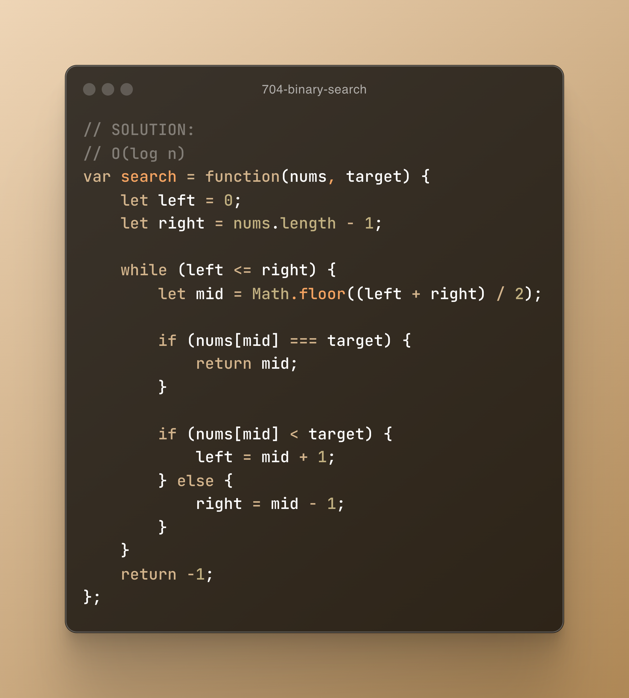

# 30 Day Coding Challenge - Focus on LeetCode/Algorithms


## Day 1 - Saturday, February 1, 2025
1. Planned out the file structure/architecture for Informy
2. Planned out the refined techstack for Informy


## Day 2 - Sunday, February 2, 2025
1. Planned out the database schemas for Informy


## Day 3 - Monday, February 3, 2025
1. Solved leetcode problem [#1 - Two Sum](https://leetcode.com/problems/two-sum/description/)

   


2. Read Chapter 2 of Grokking Algorithms: Selection Sort, Arrays, Linked Lists

Wrote this Linked List implementation: 

```
class Node {
    constructor(data) {
        this.data = data;
        this.next = null;
    }
}

class LinkedList {
    constructor() {
        this.head = null;
    }


    append(data) {
        if (!this.head) {
            this.head = new Node(data);
            return;
        }

        let currentNode = this.head;
        while (currentNode.next) {
            currentNode = currentNode.next;
        }
        currentNode.next = new Node(data);

    };

    prepend(data) {
        if (!this.head) {
            this.head = new Node(data);
            return;
        }
        let prependNode = new Node(data);
        prependNode.next = this.head;
        this.head = prependNode;

    };

    delete(value) {
        if (this.head && this.head.data === value) {
            this.head = this.head.next;
            return;
        }

        let currentNode = this.head;

        while (currentNode && currentNode.next) {
            if (currentNode.next.data === value) {
                currentNode.next = currentNode.next.next;
                return;
            }
            currentNode = currentNode.next;
        }

        console.log(`Value ${value} not found in the list.`);
    }

    print() {
        if (!this.head) {
            console.log("List is empty");
            return;
        }

        let currentNode = this.head;
        while (currentNode) {

            console.log(currentNode.data);
            currentNode = currentNode.next;
        };


    };
}

let list = new LinkedList();

list.append(20);
list.append(30);
list.prepend(10);
list.delete(20);
list.print();
```


Main takeaways from my notes on Chapter 2: 

1. Arrays vs Linked Lists - Key Differences:
   - Arrays: Fast access O(1), but slow insertions/deletions O(n)
   - Linked Lists: Slow access O(n), but fast insertions/deletions O(1)

2. When to use each:
   - Arrays: Use when you need quick access and know the size
   - Linked Lists: Use when you need frequent insertions/deletions

3. Practical Implementation:
   - Created Node class for individual elements
   - Built LinkedList class to manage the chain of nodes
   - Learned about pointer manipulation and traversal


## Day 4 - Tuesday, February 4, 2025
1. Solved leetcode problem [#217 - Contains Duplicate](https://leetcode.com/problems/contains-duplicate/description/)

   

2. Read Chapter 3 of Grokking Algorithms 

Main takeaways from Chapter 3 - Recursion:

1. **Core Concepts of Recursion:**
   - Function calls itself to solve smaller versions of the same problem
   - Must have a base case to prevent infinite loops
   - Uses call stack to track function calls

2. **Practical Implementation:**
   - Implemented factorial function using recursion
   - Learned about call stack visualization
   - Understood how recursive functions "build up" and "resolve down"

3. **Key Principles:**
   - Base case: Condition that stops recursion
   - Recursive case: Breaking problem into smaller subproblems
   - Each recursive call creates new stack frame

4. **When to Use Recursion:**
   - Best for problems that naturally break into subproblems
   - Good for tree structures and divide-and-conquer algorithms
   - Consider memory usage (call stack) for deep recursions

5. **Common Patterns:**
   - Breaking down numbers (factorial)
   - Dividing arrays (binary search)
   - Tree-like structures (file systems)


## Day 5 - Wednesday, February 5, 2025
1. Solved leetcode problem [#344 - Reverse String](https://leetcode.com/problems/reverse-string/description/)

    

2. Mostly solved leetcode problem #88 - Merge Sorted Arrays
- the solution only fixes the reference to the array but doesn't modify the provided array in-place

3. Mostly solved leetcode problem #242 - Valid Anagram
- still need to solved for edge cases


## Day 6 - Thursday, February 6, 2025
1. Solved leetcode problem [#88 - Merge Sorted Arrays](https://leetcode.com/problems/merge-sorted-array/description/)

    

2. Solved leetcode problem [#383 - Ransom Note](https://leetcode.com/problems/ransom-note/description/)

    

3. Solved leetcode problem [#704 - Binary Search](https://leetcode.com/problems/binary-search/description/)

    

4. Solved leetcode problem [#14 - Longest Common Prefix](https://leetcode.com/problems/longest-common-prefix/description/)

    
- I solved this one during a mock interview at work. I did decent but was overcomplicating my solution. The feedback was that I should be ready for the real interview now.

5. Mostly solved leetcode problem #242 - Valid Anagram. I will go back and solve for the edgecases tomorrow.

6. Set up the new Informy project from scratch

## Day 7 - Friday, February 7, 2025
1. Solved leetcode problem [#242 - Valid Anagram](https://leetcode.com/problems/valid-anagram/description/)

    

## Day 8 - Saturday, February 8, 2025
1. Solved leetcode problem [#387 - First Unique Character in a String](https://leetcode.com/problems/first-unique-character-in-a-string/description/)

    